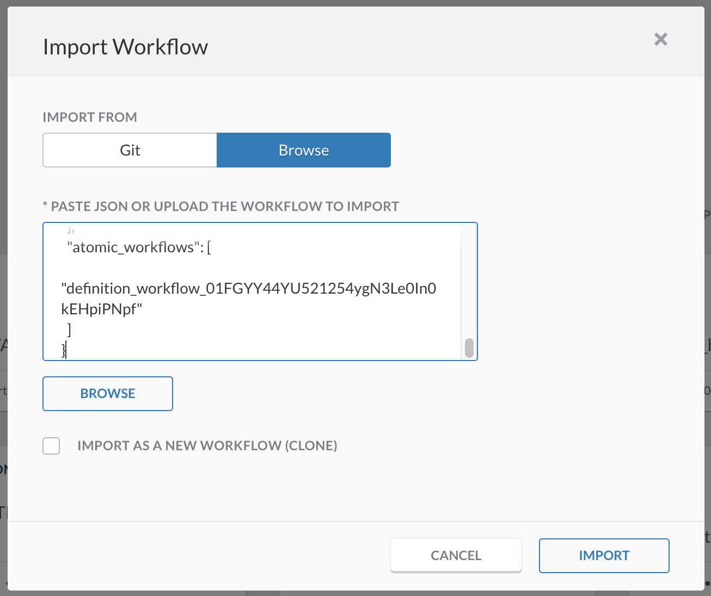
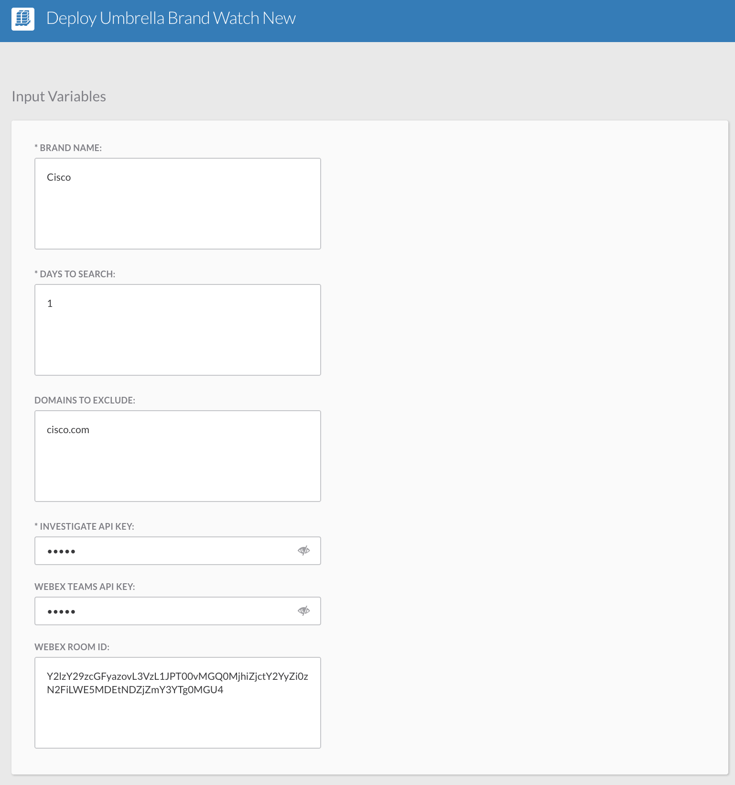
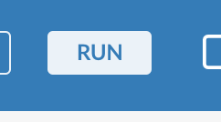

# SecureX Orchestration Workflow - Umbrella Brand Watch
A workflow for automating the discovery of imposter domains to detect typosquatting, brandjacking or similar attacks.

The original idea and python version:

* https://umbrella.cisco.com/blog/automating-imposter-domain-discovery
* https://github.com/brad-anton/brand_watch

## Features
* Automatic Regex brand generator based on https://github.com/brad-anton/brand_watch
* Ability to exclude domains
* Queries Cisco Umbrella Investigate API with adjustable settings
* Possibility to run scheduled every day
* Possibility to feed into your SOC / SIEM / TIP / ..

Based on the brand you are monitoring, you can adjust the frequency and maximum results returned.

## Installation
1. Browse to your SecureX orchestration instance. This wille be a different URL depending on the region your account is in: 

* US: https://securex-ao.us.security.cisco.com/orch-ui/workflows/
* EU: https://securex-ao.eu.security.cisco.com/orch-ui/workflows/
* APJC: https://securex-ao.apjc.security.cisco.com/orch-ui/workflows/

2. Click on **IMPORT** to import the workflow.

3. Click on **Browse** and copy paste the content of the [json file](https://raw.githubusercontent.com/bartbruninx/SecureX-Umbrella-Brandwatch/main/SecureX-Umbrella-Brandwatch.json?token=ADSV5HSSJSG7C22KPUUI7RK7TFHBI) inside of the text window. 

4. Click on **IMPORT**. 

5. Next we need to enter some variables in order for this workflow to run proberly. You can either click on **RUN** in the top right and fill in all the variables, or you can alternatively also do that in the right global properties pane.

6. You will need at least your Umbrella Investigate API key, to do the lookups. Please follow these steps to obtain yours: https://docs.umbrella.com/investigate-api/docs/about-the-api-authentication

7. Optionally you can also add domains to exclude from your results (i.e. domains that you know are safe and not imposters). Please add them, separated by commas.

8. You can also add Webex Teams details to get notifications of new findings. For that you will need:

* **Webex API Key**: please retrieve your Webex key from: https://developer.webex.com/docs/api/getting-started. Please be aware that the personal token from the getting started page only works for 12 hours. Please follow these steps to request a "bot" token: https://developer.webex.com/docs/integrations.
* **Webex Room ID**: You can create a new space or find an existing one via these link: retrieve the Room ID from: https://developer.webex.com/docs/api/v1/rooms/list-rooms. You can also add the roomid@webex.bot bot to the room and it will send you the roomId in a private message and then remove itself from the room.

9. You can also enable a trigger so that your workflow runs every day. It is recommended to enable the trigger so that the workflow runs every morning at 7AM. The investigate API will be queried for the past 24 hours per default, but both the trigger and the interval can be adjusted. 

10. Finally you can now run your workflow, by clicking on **RUN** in the top right corner.

## Notes

* Please test this properly before implementing in a production environment. This is a sample workflow!

## Author(s)

* Bart Bruninx (Cisco)
